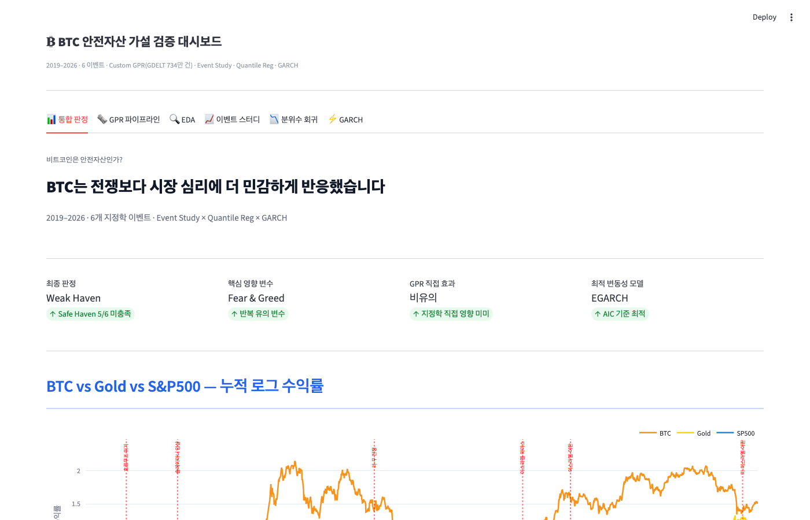
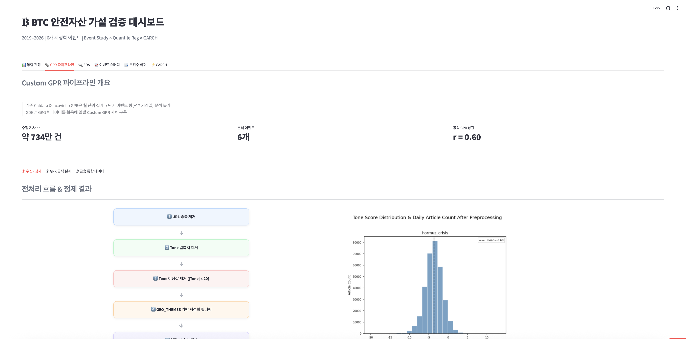
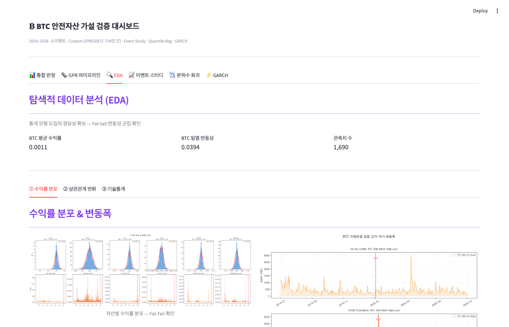
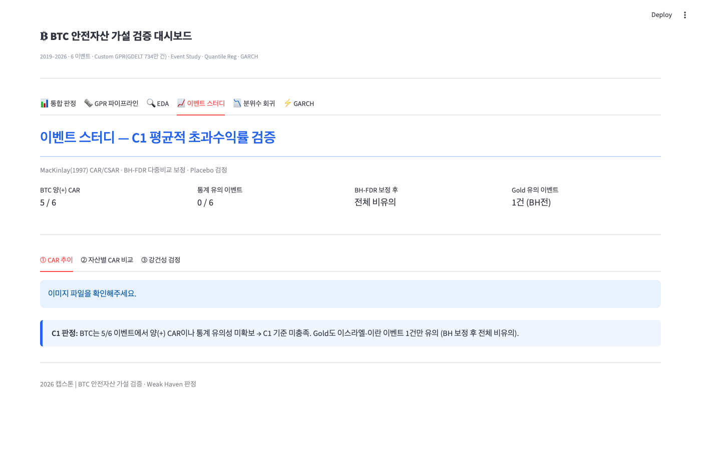
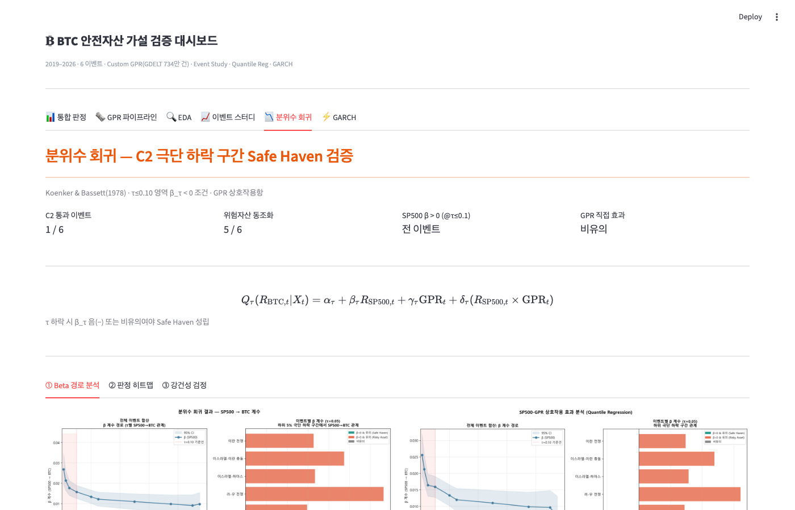
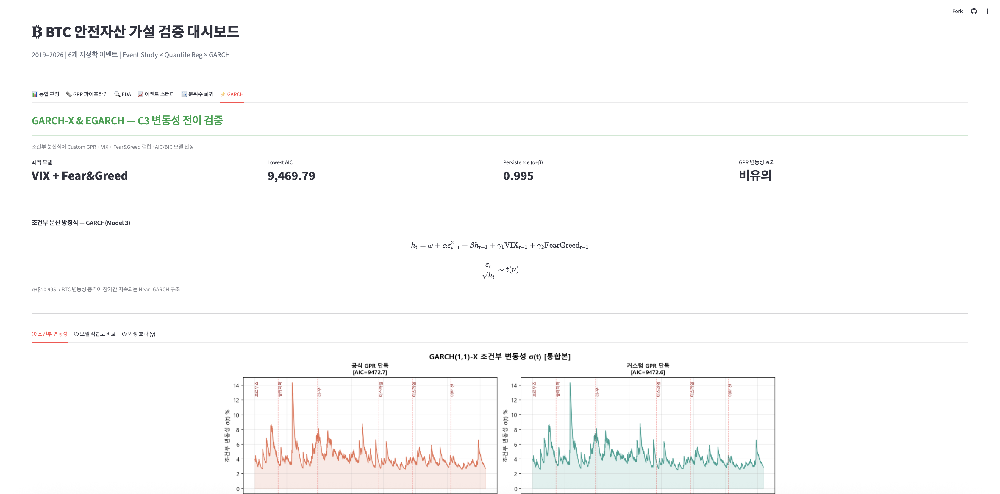

# BTC 안전자산 가설 검증 (2026 캡스톤디자인)

> **핵심 질문**: 지정학적 위기 시 비트코인은 디지털 금(안전자산)인가?

---

## 1. 프로젝트 소개

본 연구는 Baur & Lucey (2010)의 Safe-Haven 판정 기준을 6개 지정학적 이벤트에 적용하여 **BTC가 안전자산으로 기능하는지** 통계적으로 검증합니다.

| 항목 | 내용 |
|------|------|
| 분석 기간 | 2019-01-02 ~ 2026-04-30 (1,800 거래일) |
| 분석 이벤트 | 6개 지정학 위기 (이벤트 창 ±17 거래일) |
| 분석 자산 | BTC, Gold, SP500, NASDAQ, TLT, DXY |
| 판정 기준 | Baur & Lucey (2010) 3조건 통합 판정 |

**분석 대상 이벤트**

| # | 이벤트 | 기준일 |
|---|--------|--------|
| 1 | 호르무즈 위기 | 2019-06-13 |
| 2 | 솔레이마니 암살 | 2020-01-03 |
| 3 | 러시아-우크라이나 전쟁 | 2022-02-24 |
| 4 | 이스라엘-하마스 전쟁 | 2023-10-07 |
| 5 | 이스라엘-이란 충돌 | 2024-04-14 |
| 6 | 미-이스라엘-이란 전쟁 | 2026-02-28 |

---

## 2. 시스템 구조도

```
GDELT GKG (BigQuery)          야후 파이낸스 / FRED / CNN
        │                               │
        ▼                               ▼
  GPR_custom 생성                 금융 시계열 수집
  (F3 = tone × log(N))          BTC · Gold · SP500 · VIX 등
        │                               │
        └──────────┬────────────────────┘
                   ▼
            master_data.csv
            (1,827 거래일 × 19 컬럼)
                   │
       ┌───────────┼───────────┐
       ▼           ▼           ▼
  Event Study  Quantile    GARCH-X
  (CAR/CSAR)   Regression  (변동성)
       │           │           │
       └───────────┴───────────┘
                   ▼
          최종 통합 판정 (3조건)
                   ▼
           Streamlit 대시보드
```

---

## 3. 분석 방법론

### 3조건 통합 판정 (Baur & Lucey 2010)

| 조건 | 방법 | Safe-Haven 판정 기준 |
|------|------|----------------------|
| C1 이벤트 스터디 | MacKinlay (1997) CAR, BH-FDR, Placebo | CAR > 0 (비유의도 통과) |
| C2 분위수 회귀 | Koenker & Bassett (1978), HAC SE | β < 0, p < 0.05 at τ ≤ 0.10 |
| C3 GARCH | GARCH-X Student-t MLE, EGARCH 강건성 | GPR γ 비유의 (변동성 비연동) |

### 폴더별 분석 내용

| 폴더 | 분석 | 주요 방법론 |
|------|------|-------------|
| `DataPipeline/` | GPR 커스텀 지수 생성, master_data 구축 | BigQuery GDELT GKG, F3 공식 |
| `EDA/` | 기술통계, 상관관계, ARCH 검정 | ADF, Ljung-Box, ARCH-LM |
| `EventStudy/` | 이벤트별 CAR 분석 | CMRM / Market Model, Block Bootstrap (5,000회), BH-FDR |
| `Quantile/` | 위기 분위수별 β 추정 | HAC Newey-West SE, LOO 강건성, 블록 부트스트랩 |
| `GARCH/` | BTC 조건부 변동성 분석 | GARCH-X / EGARCH Student-t MLE, scipy 직접 구현 |
| `Dashboard/` | 결과 통합 시각화 | Streamlit + Plotly |
| `Validation/` | 독립 검증 | catalog v1.6, 33개 학술 표준 항목 |

---

## 4. 최종 결론

### 이벤트별 판정

| 이벤트 | C1 이벤트 스터디 | C2 분위수 회귀 | C3 GARCH | 점수 | 판정 |
|--------|:---:|:---:|:---:|:---:|------|
| 호르무즈 위기 | ✅ | ✅ | ✅ | 3/3 | **Safe Haven*** |
| 솔레이마니 암살 | ✅ | ❌ | ✅ | 2/3 | Weak Haven |
| 러-우 전쟁 | ✅ | ❌ | ✅ | 2/3 | Weak Haven |
| 이스라엘-하마스 | ❌ | ❌ | ✅ | 1/3 | Diversifier |
| 이스라엘-이란 충돌 | ❌ | ❌ | ✅ | 1/3 | Diversifier |
| 미-이스라엘-이란 | ✅ | ❌ | ✅ | 2/3 | Weak Haven |

### 핵심 발견

- **BTC는 일관된 Safe Haven으로 확인되지 않음** — 6개 이벤트 중 C2(극단 하락 구간 Safe Haven 조건)를 충족한 사례는 호르무즈 위기 1건뿐
- **위기 시 주식시장과 동조화 강화** — 5개 이벤트에서 하방 분위수(τ≤0.10) SP500 계수가 유의한 양(+)으로 나타남
- **극단 하락 국면에서도 분산 기능이 제한적** — 시장 스트레스가 커질수록 BTC-주식 연계성이 유지되거나 강화됨
- **GPR 직접 효과는 확인되지 않음** — 분위수 회귀 γ 계수와 GARCH γ 계수 모두 대부분 비유의
- **BTC 변동성은 지정학 리스크보다 시장 심리에 민감** — Fear & Greed 계수는 GARCH 및 EGARCH에서 반복적으로 유의
- **이벤트 스터디 역시 Strong Safe Haven 증거를 제공하지 못함** — 6개 이벤트 중 4개에서 양(+) CAR가 관측되었으나 BH-FDR 보정 후 전 이벤트 비유의

---

## 5. 대시보드 이미지

| 탭 | 스크린샷 |
|---|---|
| 통합 판정 |  |
| GPR 파이프라인 |  |
| EDA |  |
| 이벤트 스터디 |  |
| 분위수 회귀 |  |
| GARCH |  |

---

## 6. 팀원 역할

| 이름 | 역할 |
|------|------|
| 경승기 | 이벤트 스터디, 독립 검증 |
| 류황규 | 프로젝트 총괄 및 일정 관리, GARCH-X · EGARCH 분석 |
| 이민진 | EDA, 대시보드 개발 |
| 홍승우 (팀장) | 데이터 수집 및 전처리, 이벤트 스터디 |
| 황민정 | 데이터 파이프라인 관리, Custom GPR 지수 설계, 분위수 회귀 분석 |

---

## 7. 재현 방법 (How to Run)

### 환경 설정

```bash
pip install pandas numpy scipy statsmodels quantreg arch numdifftools \
            streamlit plotly jupyter
```

### 실행 순서

```
1. DataPipeline/master_data_generated.ipynb   ← master_data.csv 생성
2. DataPipeline/GPR_custom_analysis.ipynb     ← GPR_custom 지수 생성
3. EDA/EDA_final.ipynb                        ← 기술통계·ARCH 검정
4. EventStudy/event_study.ipynb               ← CAR·Placebo·BH 분석
5. Quantile/quantile_regression.ipynb         ← 분위수 회귀
6. GARCH/GARCH.ipynb                          ← GARCH-X·EGARCH 분석
7. streamlit run Dashboard/app.py             ← 대시보드 실행
```

### 데이터 위치

| 파일 | 경로 |
|------|------|
| 통합 분석 데이터 | `DataPipeline/processed_data/master_data.csv` |
| 자산 수익률 | `DataPipeline/processed_data/returns.csv` |
| 최종 판정 | `Dashboard/result_csv_png/final_judgment.csv` |

---

## 8. 참고문헌

**안전자산 판정 기준**
- Baur, D. G., & Lucey, B. M. (2010). Is Gold a Hedge or a Safe Haven? *Financial Review*, 45(2), 217–229.

**이벤트 스터디**
- MacKinlay, A. C. (1997). Event Studies in Economics and Finance. *Journal of Economic Literature*, 35(1), 13–39.
- Benjamini, Y., & Hochberg, Y. (1995). Controlling the False Discovery Rate. *Journal of the Royal Statistical Society: Series B*, 57(1), 289–300.

**분위수 회귀**
- Koenker, R., & Bassett, G. (1978). Regression Quantiles. *Econometrica*, 46(1), 33–50.
- Newey, W. K., & West, K. D. (1987). A Simple, Positive Semidefinite, Heteroskedasticity and Autocorrelation Consistent Covariance Matrix. *Econometrica*, 55, 703–708.

**GARCH 모형**
- Engle, R. F. (1982). Autoregressive Conditional Heteroscedasticity. *Econometrica*, 50(4), 987–1007.
- Bollerslev, T. (1986). Generalized Autoregressive Conditional Heteroskedasticity. *Journal of Econometrics*, 31(3), 307–327.
- Nelson, D. B. (1991). Conditional Heteroskedasticity in Asset Returns. *Econometrica*, 59(2), 347–370.
- Han, H., & Kristensen, D. (2014). Asymptotic Theory for GARCH-X Models. *Journal of Business & Economic Statistics*, 32(3), 416–429.

**지정학 리스크 지수**
- Caldara, D., & Iacoviello, M. (2022). Measuring Geopolitical Risk. *American Economic Review*, 112(4), 1194–1225.

**BTC 변동성 및 심리 변수**
- Bourghelle, D., Jawadi, F., & Rozin, P. (2022). Do Collective Emotions Drive Bitcoin Volatility? *Finance Research Letters*, 45, 102041.
- Liu, Y., Tsyvinski, A., & Wu, X. (2017). GARCH Model With Fat-Tailed Distributions and Bitcoin Exchange Rate Returns. *Journal of Accounting, Business and Management*, 25(1).
